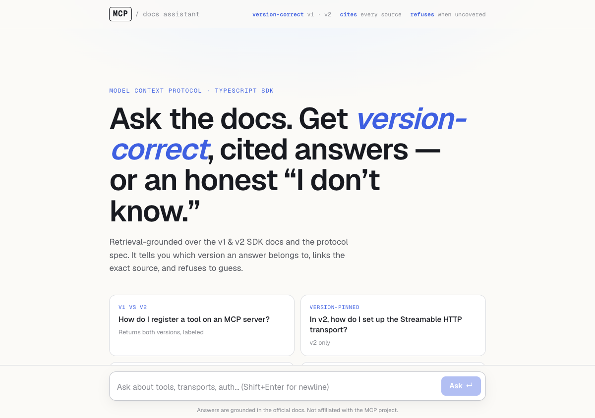
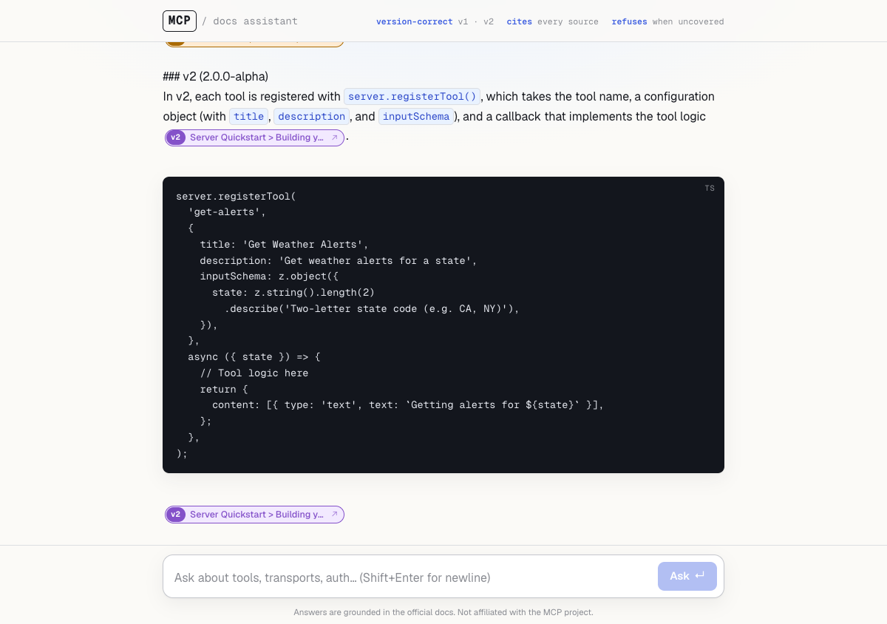

# MCP SDK Docs Assistant

> An agentic RAG assistant for the **Model Context Protocol TypeScript SDK** that answers "how do I…?" with **version-correct (v1 vs v2), cited** answers — and **refuses** when the docs don't cover it.



---

## Why this exists

The MCP TypeScript SDK recently went **v1 → v2** with breaking API changes
(`server.tool()` → `registerTool()`, SSE → Streamable HTTP, one package → three).
Generic doc bots (Context7, DeepWiki) have two failure modes that bite developers:

1. **Version-blind** — they mix v1 and v2 snippets, so copy-pasted code breaks.
2. **They never refuse** — ask anything and they hallucinate a confident answer.

This assistant fixes both. That's the differentiator:

| Discipline | How it's enforced |
| --- | --- |
| **Version-correct** | every chunk is tagged `v1`/`v2`; retrieval filters by version; answers label and split them |
| **Cited** | every claim links the exact GitHub source line |
| **Refuses** | enforced in **code**, not the prompt — see below |



---

## The idea worth stealing: refusal as code, not a prompt

Telling a model "don't hallucinate" is a suggestion it ignores under pressure.
Instead, the retrieval tool returns **empty** when nothing clears a confidence
bar — so the model has no material to fabricate from and is forced to refuse:

```ts
const candidates = await hybridSearch(query, { version, limit: 12 });
if (!hasConfidentMatch(candidates)) {          // best cosine sim < 0.45
  return { relevant: false, results: [] };     // model must refuse
}
const results = await rerank(query, candidates, 6);
return { relevant: true, results };
```

---

## Architecture

```text
                       ┌──────────── retrieval pipeline ────────────┐
  question ──► agent ──►│ hybrid search → refusal gate → LLM rerank  │──► cited answer
  (Gemini)    (tool     │ vector + lexical   ↑ refuse    flash-lite  │     or refusal
              calling)  │ fused by RRF       here        scores 0–10 │
                       └─────────────────────────────────────────────┘
                                         │
                                  Postgres + pgvector
                                  570 chunks: 58 v1 · 158 v2 · 354 spec
```

- **Ingestion** (offline): clone the SDK repos (v1 + v2) **and** the protocol spec → chunk by heading → embed → store, each chunk tagged with version + source.
- **Retrieval**: semantic (vector cosine) **fused with** lexical (Postgres full-text) via **Reciprocal Rank Fusion**, then an **LLM cross-encoder rerank**.
- **Generation**: an agent (`generateText` + a `searchDocs` tool, bounded by `stepCountIs`) that cites, splits versions, and refuses.

Three surfaces from one codebase: **web chat**, **CLI**, and an **MCP server**.

---

## Proven, not just demoed

A 12-case golden set (`eval/`) scores the behaviours that matter. `pnpm eval`:

```text
Overall pass        12/12 (100%)
Refusal accuracy     3/3 (100%)
Answer + citation    9/9 (100%)
Version-correctness  3/3 (100%)
```

The harness earned its keep: the first run scored **83%** — two answerable
questions were *false-refused* despite strong retrieval (top hits 0.70–0.72,
well above the 0.45 gate). The model was over-refusing by re-judging relevance
itself; the fix was to make refusal defer to the tool's signal. Re-run: 100%,
with refusal accuracy still 100%.

---

## Meta: it's also an MCP server

The assistant publishes *itself* as an MCP server, so Claude Desktop / Cursor can
call it as a tool — an MCP tool that teaches the MCP SDK.

```bash
pnpm mcp   # stdio server: ask_mcp_docs + search_mcp_docs
```

---

## Tech stack

- **Next.js 16** (App Router) · **AI SDK v6** (`generateText`/`streamText`, tool calling, `embed`)
- **Google Gemini** — `gemini-2.5-flash` (chat), `flash-lite` (rerank), `gemini-embedding-001` (1536-d)
- **Neon Postgres + pgvector** (HNSW cosine) · **Drizzle ORM**
- **Zod** · **Vitest** (55 unit tests) · **`@modelcontextprotocol/sdk`**

---

## Run it

```bash
pnpm install
cp .env.example .env            # add DATABASE_URL + GOOGLE_GENERATIVE_AI_API_KEY
pnpm db:setup && pnpm db:push   # pgvector + schema + full-text index
pnpm ingest                     # clone + embed the corpora (one-time)

pnpm dev                        # web chat at localhost:3000
pnpm answer "how do I register a tool?"   # CLI
pnpm eval                       # scorecard
pnpm mcp                        # MCP server
```

Deploy + observability: see [DEPLOY.md](DEPLOY.md). Engineering log: [STATUS.md](STATUS.md).
